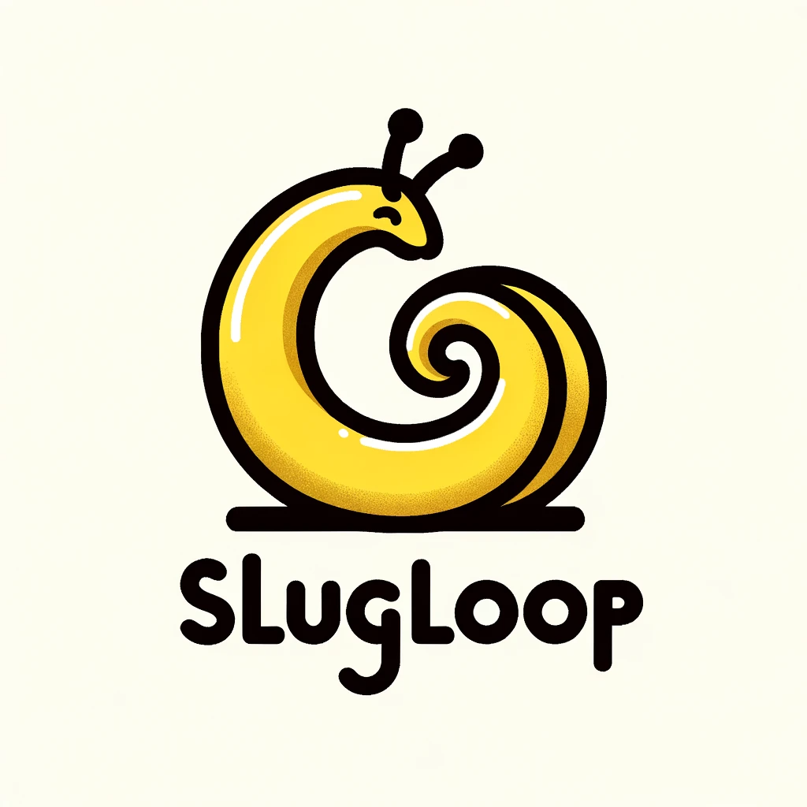
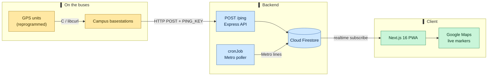

<div align="center">



# SlugLoop

### Real-time tracking for UC Santa Cruz's loop shuttles — field notes from a hackathon that went further than expected.

<sub>Four Baskin Engineering students reprogrammed the campus's decade-old GPS hardware over a weekend, put a live bus map online, and ended up the only U.S. team in the 2023 Google Solution Challenge global Top&nbsp;10.</sub>

<br/>

<a href="https://slugloop.tech/"></a>
<a href="https://www.youtube.com/watch?v=DlAGp-IjtJM"></a>
<a href="https://news.ucsc.edu/2023/07/slugloop-google-solution-challenge.html"></a>


<br/>

<a href="https://github.com/SlugLoop/SlugLoop/stargazers"></a>
<a href="https://github.com/SlugLoop/SlugLoop/network/members"></a>
<a href="./LICENSE"></a>

<br/>


<br/><br/>

<p>
  <a href="https://www.youtube.com/watch?v=DlAGp-IjtJM"><strong>Demo reel&nbsp;↗</strong></a>
  &nbsp;·&nbsp;
  <a href="#-the-problem">The problem</a>
  &nbsp;·&nbsp;
  <a href="#-what-it-does">What it does</a>
  &nbsp;·&nbsp;
  <a href="#-architecture">Architecture</a>
  &nbsp;·&nbsp;
  <a href="#-run-it">Run it</a>
  &nbsp;·&nbsp;
  <a href="#-the-team">The team</a>
</p>

</div>

---

<div align="center">

<a href="https://www.youtube.com/watch?v=DlAGp-IjtJM">
  
</a>

<sub><b>▶ SlugLoop product demo</b> — real-time loop &amp; Metro buses on one map.</sub>

</div>

---

## ▌ TL;DR

| | |
| :-- | :-- |
| **What** | A real-time map of UC Santa Cruz's loop shuttles (and nearby Santa Cruz Metro lines), built as an installable PWA. |
| **Why** | The campus loop runs on no reliable schedule, so students crowd the Metro or gamble on a bus that may never come. |
| **How** | Reprogrammed the campus's existing GPS hardware → an Express `/ping` ingest → Firestore → a live Google Map in the browser. |
| **Result** | Top&nbsp;10 global finalist — the **only U.S. team** in the 2023 Google Solution Challenge — covered by UCSC News, the Santa Cruz Sentinel, and Santa Cruz Works. |

> [!NOTE]
> **This repo is a preserved case study.** The map you see today is a frozen field-notebook demo. The original build ran a live hardware feed on Azure during the 2023 season. See [Build context](#-build-context--whats-in-this-repo) for the diff.

---

## ▌ The problem

UC Santa Cruz sprawls across a redwood hillside with serious elevation changes — getting to class on time means catching a loop shuttle. But the loop runs on no predictable schedule. So students either pile onto the city Metro (taking seats from people actually leaving campus) or wait for a loop that may not show, and end up late anyway.

There was no way to see *where* the buses actually were. The data existed — campus had installed GPS-emitting hardware on the buses years earlier — it just wasn't going anywhere useful.

SlugLoop's bet: don't deploy new hardware, **revive the hardware already on the buses** and put its signal on a map.

---

## ▌ Awards &amp; recognition

| Recognition | Awarded by |
| :-- | :-- |
| 🏆 **Top 10 Global Finalist — only U.S. team** | Google Solution Challenge 2023 |
| 🥇 **Best Use of GitHub** | CruzHacks 2023 |
| 📰 **Featured: "UCSC team a Google Solution Challenge finalist"** | [UCSC News](https://news.ucsc.edu/2023/07/slugloop-google-solution-challenge.html), [Santa Cruz Sentinel](https://www.santacruzsentinel.com/2023/07/26/uc-santa-cruz-team-make-final-round-of-google-app-challenge/), [Santa Cruz Works](https://www.santacruzworks.org/news/cruzhacks-team-in-the-top-10-google-solutions-challenge) |

<sub>SlugLoop began at CruzHacks 2023, then advanced through the Google Solution Challenge to a global Top&nbsp;10 finish — the sole U.S. team in that round.</sub>

---

## ▌ What it does

<table>
<tr>
<td valign="top" width="33%">

### 🗺️ Live bus map
Every tracked loop shuttle as a moving marker on a Google Map, refreshed in real time straight from Firestore.

</td>
<td valign="top" width="33%">

### 🚌 Loop + Metro in one view
Campus loop shuttles and nearby Santa Cruz Metro lines on the same map, so you can decide which to take.

</td>
<td valign="top" width="33%">

### 🧭 Direction &amp; nearest stop
Heading and next-stop logic so you know not just *when* a bus is near, but *where it's going*.

</td>
</tr>
<tr>
<td valign="top">

### 📲 Installable PWA
Standalone install, offline shell, and home-screen shortcuts to the map and timeline — no app store.

</td>
<td valign="top">

### 📓 Field-notebook site
A preserved case-study experience: the build journey, a project timeline, and a frozen demo of the map.

</td>
<td valign="top">

### 🔓 Open source
Apache-2.0, built to be handed off to the next cohort of UCSC students.

</td>
</tr>
</table>

---

## ▌ Architecture

<details open>
<summary><b>From the bus antenna to the browser</b></summary>



</details>

1. **On the bus** — reprogrammed GPS units emit position; campus basestations receive it (some receivers push over HTTP using custom C + `libcurl`).
2. **Ingest** — basestations `POST /ping` to the Express server with a shared `PING_KEY` secret; the server validates, parses bus ID / lat / lng / route, and writes to Firestore.
3. **Metro** — a Dockerized `cronJob` polls nearby Santa Cruz Metro lines and writes them alongside the loop data.
4. **Client** — the Next.js PWA subscribes to Firestore in real time and renders live markers on Google Maps. No polling the server — the map updates as the database does.

---

## ▌ Tech stack

| Layer | Tools |
| :-- | :-- |
| **Frontend** | Next.js&nbsp;16 (App Router), React&nbsp;19, Framer&nbsp;Motion, Radix&nbsp;UI, Tailwind&nbsp;CSS&nbsp;v4 |
| **Maps** | Google Maps (`google-maps-react-markers`) |
| **Realtime data** | Firebase · Cloud Firestore |
| **Backend** | Node.js, Express&nbsp;4, `express-rate-limit`, Swagger / OpenAPI validator |
| **Hardware pipeline** | Reprogrammed campus GPS units &amp; basestations, C + `libcurl`, `/ping` ingest |
| **Jobs** | Dockerized `cronJob` Metro poller |
| **PWA** | Web manifest, service worker, install + offline shell |
| **Testing** | Jest, React Testing Library, Playwright (e2e) |
| **Analytics / hosting** | Vercel Analytics · originally hosted on Microsoft Azure |

---

## ▌ Page map

The live site is itself part of the story — a field notebook, not just a map.

| Route | Purpose |
| :-- | :-- |
| `/` | Field-notebook landing — the hook and the headline |
| `/map` | The live demo map: loop shuttles + Metro |
| `/journey` | How the build happened, weekend to finals |
| `/timeline` | Project milestones |
| `/about` | The team |
| `/contact` | Reach the team |

---

## ▌ Run it

<details>
<summary><b>Local setup — frontend &amp; backend</b></summary>

```bash
# 1. Clone
git clone https://github.com/SlugLoop/SlugLoop.git
cd SlugLoop

# 2. Frontend (Next.js PWA)
cd client
pnpm install
pnpm dev            # http://localhost:3000

# 3. Backend (Express ingest API) — separate terminal
cd ../server
npm install
npm start
```

**Tests**

```bash
# client (unit + RTL)        # client (e2e)
cd client && pnpm test       cd client && pnpm test:e2e
# server
cd server && npm test
```

> [!IMPORTANT]
> The backend needs environment variables that are **not** in this repo: Firebase Admin credentials, a Google Maps API key, and the `PING_KEY` ingest secret. Without them the client runs against the preserved demo data; the live hardware feed does not. Contact the team for production values.

</details>

---

## ▌ The team

<sub>Four Baskin Engineering students (UCSC, B.S. Computer Science '23).</sub>

<table>
<tr>
<td valign="top" align="center" width="25%">

<br/>
**Bill Zhang** ⭐<br/>
<sub>Lead Developer · Full-Stack / PM</sub><br/><br/>
<a href="https://github.com/IdkwhatImD0ing"></a>
<a href="https://www.linkedin.com/in/bill-zhang1/"></a>

</td>
<td valign="top" align="center" width="25%">

<br/>
**Alex Liu**<br/>
<sub>Backend / Data Pipeline · Frontend</sub><br/><br/>
<a href="https://github.com/azliuu"></a>
<a href="https://www.linkedin.com/in/alex-liu-8689a1171/"></a>

</td>
<td valign="top" align="center" width="25%">

<br/>
**Annie Liu**<br/>
<sub>Frontend · UI / UX Lead</sub><br/><br/>
<a href="https://github.com/mercury128"></a>
<a href="https://www.linkedin.com/in/annieliu404/"></a>

</td>
<td valign="top" align="center" width="25%">

<br/>
**Nick Szwed**<br/>
<sub>Hardware / Embedded · Backend</sub><br/><br/>
<a href="https://github.com/NickSzd"></a>
<a href="https://www.linkedin.com/in/nicholas-szwed/"></a>

</td>
</tr>
</table>

---

## ▌ Repository layout

<details>
<summary><b>What's where</b></summary>

```text
SlugLoop/
├── client/              # Next.js 16 PWA — the preserved case-study site + demo map
│   ├── app/             # App Router routes: map, journey, timeline, about, contact
│   ├── src/             # components, lib, firebase client
│   ├── __tests__/       # Jest + React Testing Library
│   └── e2e/             # Playwright parity tests
├── client-legacy/       # Original Create React App + Material UI build (2023)
├── server/              # Express ingest API — POST /ping, Metro routes, Firestore writes
│   ├── routes/          # index (bus ingest), metro
│   ├── functions/       # direction, convert, soonBusStop, pingHelper
│   └── initialization/  # firebase admin init
├── cronJob/             # Dockerized Santa Cruz Metro poller
├── SlugLoop.png         # project mark
└── LICENSE              # Apache-2.0
```

</details>

---

## ▌ Build context &amp; what's in this repo

A hackathon project is a weekend, not a product — and this repo is honest about that. SlugLoop was rebuilt afterward as a preserved **case study**, so what you clone is not byte-for-byte what ran live in 2023.

| | Original build (2023) | This repo |
| :-- | :-- | :-- |
| **Frontend** | Create React App + Material UI | Next.js 16 + React 19 (rebuilt) — original kept in `client-legacy/` |
| **Hardware feed** | Live GPS units → basestations → `/ping` | Preserved demo data on the map |
| **Hosting** | Microsoft Azure | Static preserved site |
| **Purpose** | Live campus utility | Field-notebook case study of the build |

Known limits of the weekend scope: hardware coverage was never the full fleet (some receivers were broken), and arrival-time prediction (an ML ETA model) was always a "what's next," not a shipped feature.

---

## ▌ License

[Apache-2.0](./LICENSE) — built to be forked, learned from, and carried forward by the next cohort of UCSC students.

---

<details>
<summary><b>📑 Sources &amp; footnotes</b></summary>

- **Award (Top 10, only U.S. team)** — UCSC News, *"UCSC team a Google Solution Challenge finalist,"* 2023-07-31: <https://news.ucsc.edu/2023/07/slugloop-google-solution-challenge.html>
- **Independent press** — Santa Cruz Sentinel, 2023-07-26: <https://www.santacruzsentinel.com/2023/07/26/uc-santa-cruz-team-make-final-round-of-google-app-challenge/>
- **Origin at CruzHacks** — Santa Cruz Works, 2023-07-28: <https://www.santacruzworks.org/news/cruzhacks-team-in-the-top-10-google-solutions-challenge>
- **Demo video** — <https://www.youtube.com/watch?v=DlAGp-IjtJM>
- **Live site** — <https://slugloop.tech/>
- Every figure above is sourced; no awards, ranks, or statistics are invented. Items marked `TODO` are awaiting confirmation and are intentionally left blank rather than guessed.

</details>

<div align="center">
<sub>Built at CruzHacks 2023 by four UCSC Baskin Engineering students · <a href="https://slugloop.tech/">slugloop.tech</a> · <a href="https://github.com/SlugLoop/SlugLoop">GitHub</a></sub>
<br/><br/>
<a href="#slugloop">↑ back to top</a>
</div>
